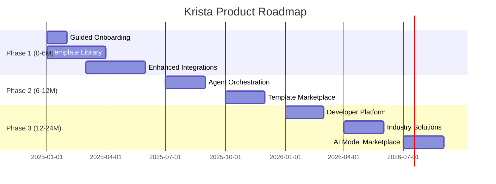

# How to Showcase This Case Study on GitHub

## 🎯 Quick Start

This guide will help you publish this PM case study on GitHub to showcase your product management skills.

## 📋 Prerequisites

- GitHub account
- Git installed on your computer
- Basic familiarity with Git commands

## 🚀 Option 1: Standard GitHub Repository (Recommended)

### Step 1: Create Repository

1. Go to [github.com](https://github.com) and log in
2. Click "New repository" (+ icon in top right)
3. Name: `krista-pm-case-study`
4. Description: "Product Management case study for Krista AI platform - roadmap, prioritization, and strategic thinking"
5. Make it **Public** (so recruiters can see it)
6. Check "Add README file"
7. Click "Create repository"

### Step 2: Upload Files

**Method A: Via GitHub Web Interface (Easiest)**

1. In your repository, click "Add file" → "Upload files"
2. Drag and drop ALL files from this case study folder
3. Commit message: "Add complete PM case study for Krista platform"
4. Click "Commit changes"

**Method B: Via Git Command Line**

```bash
# Navigate to where you want to store the project
cd ~/projects

# Clone your new repository
git clone https://github.com/YOUR_USERNAME/krista-pm-case-study.git

# Copy all case study files into this directory
cp -r /path/to/krista-pm-case-study/* krista-pm-case-study/

# Add, commit, and push
cd krista-pm-case-study
git add .
git commit -m "Add complete PM case study for Krista platform"
git push origin main
```

### Step 3: Enhance README

Edit the main `README.md` to personalize it:

```markdown
# Krista Platform - Product Management Case Study

By [Your Name](https://linkedin.com/in/your-profile)

## 🎯 About This Project

This is a comprehensive product management case study demonstrating:
- Strategic roadmap planning (0-24 months)
- Prioritization frameworks (RICE methodology)
- Technical feasibility assessment
- Go-to-market strategy
- Stakeholder communication

**Completed:** [Date]  
**Context:** PM interview case study for Krista AI platform

[View Executive Summary](./executive-summary.md) | [View Full Roadmap](./roadmap/)
```

### Step 4: Add Visual Assets (Optional but Recommended)

Create simple visual diagrams:

**Tools:**
- **Figma** (free) - For roadmap timelines and diagrams
- **Miro** (free) - For process flows
- **Google Slides** - For presentation-style visuals
- **Canva** (free) - For infographics

**Suggested Visuals:**
1. `roadmap-timeline.png` - Gantt-style timeline showing all initiatives
2. `prioritization-matrix.png` - RICE score visualization
3. `architecture-diagram.png` - Technical architecture overview
4. `competitive-landscape.png` - Positioning map

Add these to an `assets/` folder in your repo.

---

## 🌐 Option 2: GitHub Pages (Portfolio Website)

For a more polished presentation, use GitHub Pages to create a website.

### Step 1: Enable GitHub Pages

1. In your repository, go to Settings
2. Scroll to "Pages" section (left sidebar)
3. Under "Source," select "main" branch
4. Click "Save"
5. Your site will be published at: `https://YOUR_USERNAME.github.io/krista-pm-case-study/`

### Step 2: Create Index Page

Create `index.html` in the root directory:

```html
<!DOCTYPE html>
<html lang="en">
<head>
    <meta charset="UTF-8">
    <meta name="viewport" content="width=device-width, initial-scale=1.0">
    <title>Krista PM Case Study - [Your Name]</title>
    <style>
        body {
            font-family: -apple-system, BlinkMacSystemFont, 'Segoe UI', sans-serif;
            line-height: 1.6;
            max-width: 1200px;
            margin: 0 auto;
            padding: 20px;
            background: #f5f5f5;
        }
        header {
            background: linear-gradient(135deg, #667eea 0%, #764ba2 100%);
            color: white;
            padding: 60px 40px;
            border-radius: 10px;
            margin-bottom: 40px;
        }
        h1 { margin: 0; font-size: 2.5em; }
        .subtitle { opacity: 0.9; margin-top: 10px; }
        .cards {
            display: grid;
            grid-template-columns: repeat(auto-fit, minmax(300px, 1fr));
            gap: 20px;
            margin: 40px 0;
        }
        .card {
            background: white;
            padding: 30px;
            border-radius: 8px;
            box-shadow: 0 2px 8px rgba(0,0,0,0.1);
            transition: transform 0.2s;
        }
        .card:hover { transform: translateY(-5px); }
        .card h3 { margin-top: 0; color: #667eea; }
        .cta-button {
            display: inline-block;
            background: #667eea;
            color: white;
            padding: 12px 24px;
            border-radius: 6px;
            text-decoration: none;
            margin-top: 10px;
        }
        .cta-button:hover { background: #5568d3; }
    </style>
</head>
<body>
    <header>
        <h1>Krista Platform: PM Case Study</h1>
        <p class="subtitle">Strategic roadmap and prioritization framework by [Your Name]</p>
    </header>

    <section>
        <h2>🎯 Project Overview</h2>
        <p>A comprehensive product management case study for Krista AI's intelligent automation platform, demonstrating strategic thinking, prioritization methodology, and technical fluency.</p>
    </section>

    <div class="cards">
        <div class="card">
            <h3>📊 Executive Summary</h3>
            <p>High-level strategic vision and 24-month roadmap overview</p>
            <a href="executive-summary.html" class="cta-button">Read Summary</a>
        </div>

        <div class="card">
            <h3>🗓️ 0-6 Month Roadmap</h3>
            <p>Foundation phase focused on adoption and quick wins</p>
            <a href="roadmap/0-6-months.html" class="cta-button">View Roadmap</a>
        </div>

        <div class="card">
            <h3>🚀 6-12 Month Roadmap</h3>
            <p>Differentiation through AI agent orchestration</p>
            <a href="roadmap/6-12-months.html" class="cta-button">View Roadmap</a>
        </div>

        <div class="card">
            <h3>🌟 12-24 Month Roadmap</h3>
            <p>Platform maturity and ecosystem development</p>
            <a href="roadmap/12-24-months.html" class="cta-button">View Roadmap</a>
        </div>

        <div class="card">
            <h3>⚖️ Prioritization Framework</h3>
            <p>RICE methodology and decision-making process</p>
            <a href="roadmap/prioritization-framework.html" class="cta-button">Read Framework</a>
        </div>

        <div class="card">
            <h3>🔍 Platform Analysis</h3>
            <p>Deep dive into Krista's capabilities and market position</p>
            <a href="product-analysis/platform-analysis.html" class="cta-button">View Analysis</a>
        </div>
    </div>

    <section style="margin-top: 60px; text-align: center;">
        <h2>About the Author</h2>
        <p>[Your Name] - Product Manager</p>
        <a href="https://linkedin.com/in/your-profile" class="cta-button">LinkedIn</a>
        <a href="mailto:your.email@example.com" class="cta-button">Email</a>
    </section>
</body>
</html>
```

### Step 3: Convert Markdown to HTML

Use a GitHub Actions workflow to automatically convert markdown to HTML:

Create `.github/workflows/deploy.yml`:

```yaml
name: Deploy to GitHub Pages

on:
  push:
    branches: [ main ]

jobs:
  build-and-deploy:
    runs-on: ubuntu-latest
    steps:
      - uses: actions/checkout@v2
      
      - name: Install Pandoc
        run: sudo apt-get install -y pandoc
      
      - name: Convert Markdown to HTML
        run: |
          find . -name "*.md" -not -path "./.git/*" -exec sh -c '
            pandoc "$1" -o "${1%.md}.html" \
              --standalone \
              --css=https://cdn.jsdelivr.net/npm/github-markdown-css@5.1.0/github-markdown.min.css \
              --metadata title="Krista PM Case Study"
          ' sh {} \;
      
      - name: Deploy to GitHub Pages
        uses: peaceiris/actions-gh-pages@v3
        with:
          github_token: ${{ secrets.GITHUB_TOKEN }}
          publish_dir: .
```

---

## 📱 Option 3: Add to Your Portfolio Site

If you have an existing portfolio website, add a dedicated page:

**Suggested URL:** `yoursite.com/projects/krista-case-study`

**Page Structure:**
1. Hero section with project overview
2. Challenge/Objective section
3. Approach and methodology
4. Key deliverables (with links to docs)
5. Outcomes and insights
6. Call-to-action (view full case study on GitHub)

---

## 🎨 Making It Visually Appealing

### Add a Banner Image

Create a simple hero image in Canva or Figma:
- Dimensions: 1200x630px (Twitter card size)
- Include: "Krista PM Case Study" + your name
- Color scheme: Professional blues/purples
- Save as `assets/banner.png`

Update README:

```markdown


# Krista Platform - Product Management Case Study
```

### Add Diagrams and Charts

Use Mermaid.js (supported by GitHub):

```markdown
## Roadmap Timeline


```

---

## 📣 Promoting Your Case Study

### Update LinkedIn

Post announcement:

```
🎯 Excited to share my latest product management case study!

I developed a comprehensive 24-month roadmap for Krista AI's intelligent automation platform, demonstrating:

✅ Strategic prioritization (RICE framework)
✅ Technical feasibility assessment
✅ Go-to-market planning
✅ Competitive positioning

The case study covers:
• 0-6 month foundation & velocity phase
• 6-12 month differentiation & scale phase
• 12-24 month platform maturity & ecosystem

Check it out: [GitHub link]

#ProductManagement #Roadmap #Strategy #AI #Automation

[Tag Krista Software if appropriate]
```

### Add to Resume

**Projects Section:**
```
Krista AI Platform: Product Roadmap Case Study
• Developed comprehensive 24-month product roadmap balancing customer impact, 
  technical feasibility, and strategic vision
• Applied RICE prioritization framework to evaluate 30+ initiatives
• Defined go-to-market strategy for AI agent orchestration (new category)
• [Link to GitHub]
```

---

## ✅ Final Checklist

Before sharing publicly:

- [ ] All markdown files formatted correctly
- [ ] No placeholder text ("YOUR_NAME", "[Date]", etc.)
- [ ] All links work (test internal links between documents)
- [ ] README.md has clear introduction and navigation
- [ ] Personal branding added (name, LinkedIn, email)
- [ ] Repository description filled in
- [ ] Topics/tags added (e.g., "product-management", "roadmap", "ai")
- [ ] Optional: Visual assets added
- [ ] Optional: GitHub Pages enabled
- [ ] Spellcheck complete
- [ ] Grammar check complete

---

## 🎯 Success Metrics

You'll know your showcase is effective when:

✅ **Recruiters can quickly understand your approach** (< 5 minutes)  
✅ **Navigation is intuitive** (can find any section in < 3 clicks)  
✅ **Shows depth without overwhelming** (executive summary + details)  
✅ **Demonstrates key PM skills** (prioritization, strategy, communication)  
✅ **Professional appearance** (clean formatting, no errors)

---

## 💡 Pro Tips

1. **Add a Table of Contents** in README using anchor links
2. **Include a "Skills Demonstrated" section** explicitly listing PM competencies
3. **Add timestamps** showing how long certain phases took (demonstrates velocity)
4. **Create a video walkthrough** (5-minute Loom explaining the roadmap)
5. **Write a blog post** on Medium/Substack linking to the GitHub case study
6. **Keep it updated** as you learn new frameworks or approaches

---

Good luck with your showcase! This comprehensive case study demonstrates exactly the kind of strategic thinking, prioritization, and communication skills that hiring managers look for in PMs.
